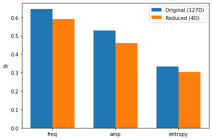

# Topological_SWR

This notebook illustrates the pipeline of the topological analysis of sharp-wave ripples (SWR) as published in Sebastian et al., Nat Neu 2023 (<a href="https://www.nature.com/articles/s41593-023-01471-9" target="_blank">https://www.nature.com/articles/s41593-023-01471-9</a>). 

<a href="https://github.com/PridaLab/Topological_SWR/blob/main/TopologicalRippleClassification.ipynb" target="_blank">TopologicalRippleClassification.ipynb</a> is a jupyter notebook with an example of the code used for this project.

This notebook illustrates the pipeline of the topological analysis of SWR. Given that some parts of the code are computationally expensive, we provide pre-computed results in a file. If you are interested in either testing your own data or check the computation of the provided dataset you can execute the corresponding part locally.

The pipeline consists in different steps involving different topological analysis. The first step is to compute Persistent Homology barcodes over the dataset to know about its components, holes and cavities.

In this case we see we have only one continuous component without holes or cavities.

Next step is to visualize how our dataset features project over the point cloud using dimensionality reduction.

Finally we can quantify how structured are these features over the point cloud in any space with an arbitrary number of dimensions using our tool, the Structure Index (https://github.com/PridaLab/structure_index.git).

